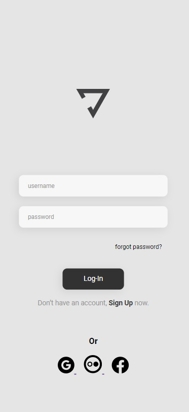

# Yoga Interface

## 🤝 Colaboradores

Agradecemos às seguintes pessoas que contribuíram para este projeto:

<table>
  <tr>
    <td align="center">
      <a href="#">
         
        
          <b>Iuri Silva</b>
        
      </a>
    </td>
    <td align="center">
      <a href="#">
         
        
          <b>Rodolfo Mori-Devclub</b>
        
      </a>
    </td>
    <td align="center">
      <a href="#">
         
        
          <b>Lucas Lima</b>
        
      </a>
    </td>
  </tr>
</table>

## 💼 Tecnologias Utilizadas

Para esse projeto foi utilizada as seguintes tecnologias:

>CSS
>HTML

